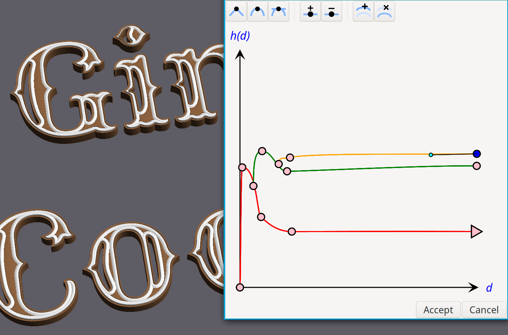
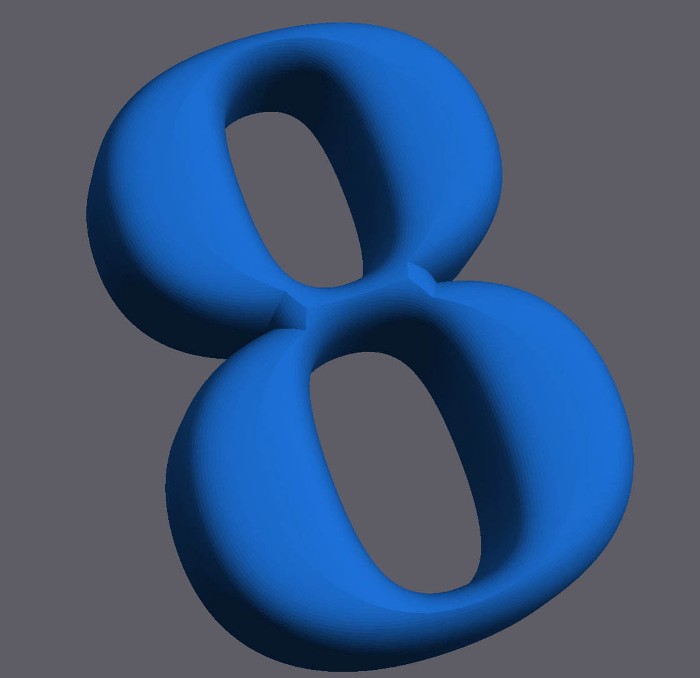
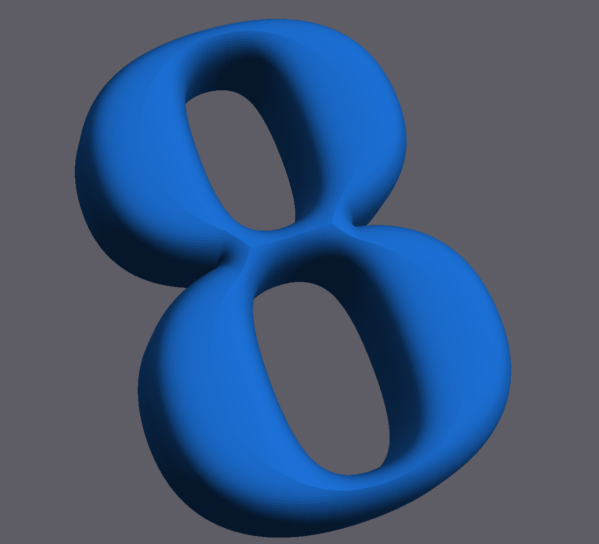

# Intro

Pomelo is a graphic interactive program for creating 3D meshes of text. The resulting mesh may be exported as a STL file, e.g. for importing into Blender for further processing.

See also a short intro at: https://www.youtube.com/watch?v=mCoGFMXl4X8

# Used technologies

- pango
- cairo
- gtkmm
- CGAL

# Usage

1. Run Pomelo
2. Enter desired text
3. Choose font
4. Press build button to build the "skeloton"
5. Choose profile, either Round or Curve
6. Choose profile parametes for round or edit the curve 
7. Choose Z-depth
8. Press Build
9. Export to STL or GLTF

# Overview 

Pomelo works by a two phase algorithm:

1. Creation of a [Straight Skeleton](https://en.wikipedia.org/wiki/Straight_skeleton)
2. Creation of the mesh based on the straight skeleton, and the choosen profile.

# Profiles

Pomelo supports two types of profiles:

1. The round profile, creates a round edge, smoothing the transition vertical to horizontal with a round radius.
2. Through a Bezier based profile editor, that allow creating multiple profiles that are inserted on top of one another.

# Smoothing

The straight skeleton's sometimes create sharp and ugly geometry. This may be partly mitigated 
by turning on Settings/Smoothing option, which inserts additional nodes in the skeleton. However, the smoothing may itself create other artifacts. 

# Technical description

See: [Technical description](TechnicalDescription.md)

# License

This program is released under the GPLv3 license. See COPYING for licensing details.

# Author

Dov Grobgeld <dov.grobgeld@gmail.com>

# Gallery

