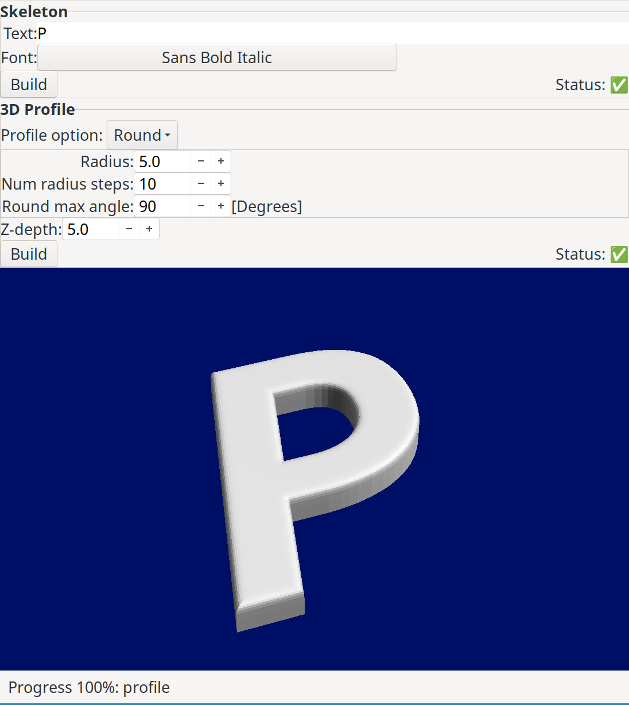
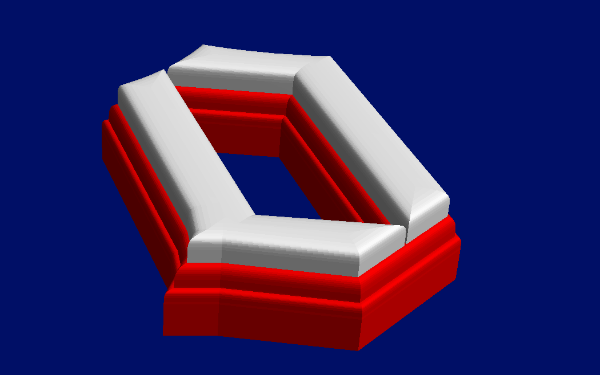
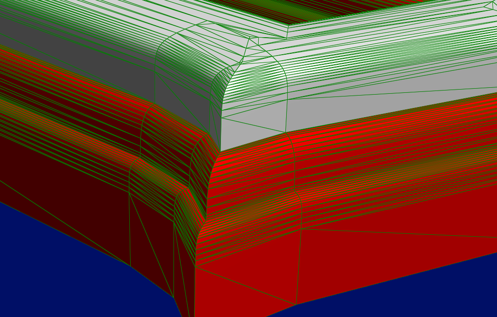
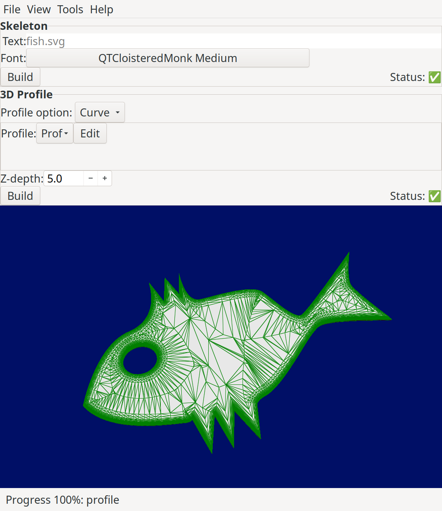

# Intro

Pomelo is a graphic interactive program for creating 3D meshes of text. The resulting mesh may be exported as a STL file, e.g. for importing into Blender for further processing.

# Used technologies

- pango
- cairo
- gtkmm
- CGAL

# Usage

1. Run Pomelo
2. Enter desired text
3. Choose font
4. Press build button to build the "skeloton"
5. Choose profile, either Round or Curve
6. Choose profile parametes for round or edit the curve 
7. Choose Z-depth
8. Press Build
9. Export to STL or GLTF

# Known problems

The main problem of pomelo is related to the creation of the "straight skeleton", see [[https://en.wikipedia.org/wiki/Straight_skeleton]], a geometric construct that roughly describes the "middle" of the outline. 

Here are some known problems related to the straight skeleton:

1. It sometimes gets stuck for an indefinite time
2. It sometimes crashes the program
3. It sometimes does not "create anything"
4. It creates ugly geometries of internal sharp angles

Pomelo contains mitigation for problem 4, through the advanced setting "smooth sharp angles", which makes the resulting geometry more pleasing. Unfortunately, it also has the side effect making the first three problems more likely to occur.

Currently, for complex fonts and geometry, there is no other option than testing what works.

# Technical description

See: [Technical description](TechnicalDescription.md)

# License

This program is released under the GPLv3 license. See COPYING for licensing details.

# Author

Dov Grobgeld <dov.grobgeld@gmail.com>

# Gallery

