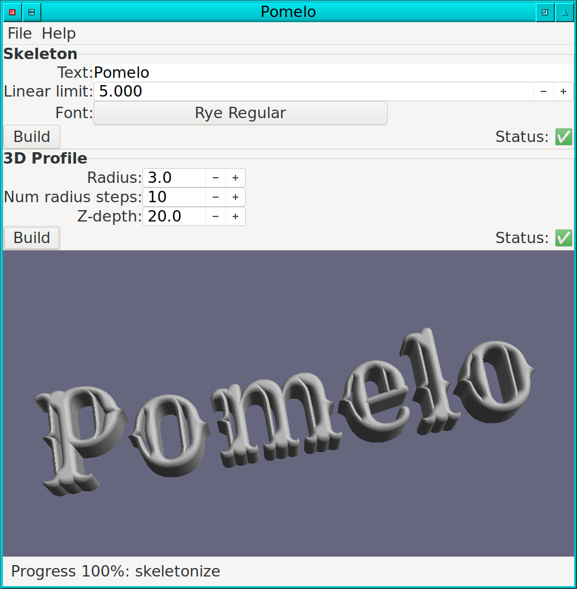

# Intro

Pomelo is a graphic interactive program for creating 3D meshes of text. The resulting mesh may be exported as a STL file, e.g. for importing into Blender for further processing.

# Used technologies

- pango
- cairo
- gtkmm
- CGAL

# License

This program is released under the GPLv3 license. See COPYING for licensing details.

# Author

Dov Grobgeld <dov.grobgeld@gmail.com>
